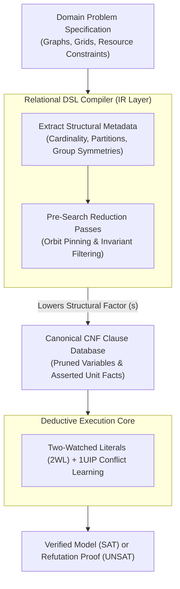

```mermaid
flowchart TD
    Domain["Domain Problem Specification<br/>(Graphs, Grids, Resource Constraints)"]

    subgraph Compiler["Relational DSL Compiler (IR Layer)"]
        direction TB
        Meta["Extract Structural Metadata<br/>(Cardinality, Partitions, Group Symmetries)"]
        Opt["Pre-Search Reduction Passes<br/>(Orbit Pinning & Invariant Filtering)"]
        Meta --> Opt
    end

    CNF["Canonical CNF Clause Database<br/>(Pruned Variables & Asserted Unit Facts)"]

    subgraph Core["Deductive Execution Core"]
        direction TB
        CDCL["Two-Watched Literals (2WL) + 1UIP Conflict Learning"]
    end

    Out["Verified Model (SAT) or Refutation Proof (UNSAT)"]

    Domain --> Compiler
    Compiler -->|"Lowers Structural Factor (s)"| CNF
    CNF --> Core
    Core --> Out
```
