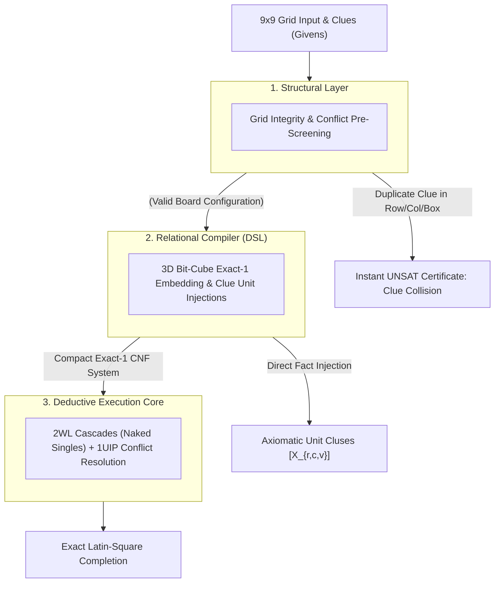

```mermaid
flowchart TD
    Input["9x9 Grid Input & Clues (Givens)"]

    subgraph L1["1. Structural Layer"]
        direction TB
        L1_Desc["Grid Integrity & Conflict Pre-Screening"]
    end

    subgraph L2["2. Relational Compiler (DSL)"]
        direction TB
        L2_Desc["3D Bit-Cube Exact-1 Embedding & Clue Unit Injections"]
    end

    subgraph L3["3. Deductive Execution Core"]
        direction TB
        L3_Desc["2WL Cascades (Naked Singles) + 1UIP Conflict Resolution"]
    end

    Out1["Instant UNSAT Certificate: Clue Collision"]
    Out2["Axiomatic Unit Cluses [X_{r,c,v}]"]
    Out3["Exact Latin-Square Completion"]

    Input --> L1
    L1 -->|"Duplicate Clue in Row/Col/Box"| Out1
    L1 -->|"(Valid Board Configuration)"| L2
    L2 -->|"Direct Fact Injection"| Out2
    L2 -->|"Compact Exact-1 CNF System"| L3
    L3 --> Out3
```

