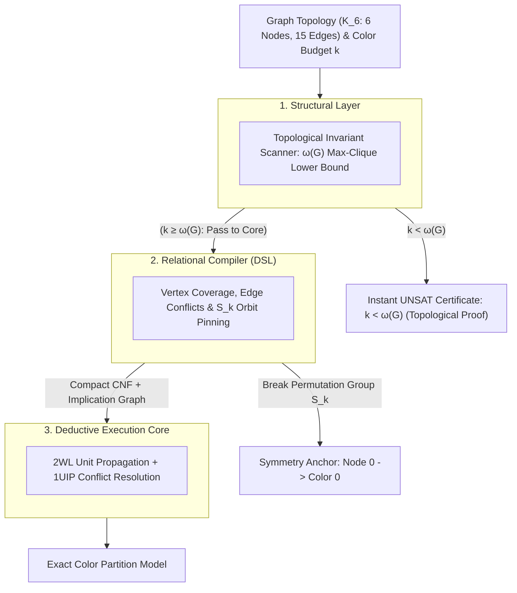

#  Designing a Structural Reasoning Engine: Systems Architecture Guide for Complete Graph ($K_6$) Coloring

```mermaid
flowchart TD
    Input["Graph Topology (K_6: 6 Nodes, 15 Edges) & Color Budget k"]

    subgraph L1["1. Structural Layer"]
        direction TB
        L1_Desc["Topological Invariant Scanner: ω(G) Max-Clique Lower Bound"]
    end

    subgraph L2["2. Relational Compiler (DSL)"]
        direction TB
        L2_Desc["Vertex Coverage, Edge Conflicts & S_k Orbit Pinning"]
    end

    subgraph L3["3. Deductive Execution Core"]
        direction TB
        L3_Desc["2WL Unit Propagation + 1UIP Conflict Resolution"]
    end

    Out1["Instant UNSAT Certificate: k < ω(G) (Topological Proof)"]
    Out2["Symmetry Anchor: Node 0 -> Color 0"]
    Out3["Exact Color Partition Model"]

    Input --> L1
    L1 -->|"k < ω(G)"| Out1
    L1 -->|"(k ≥ ω(G): Pass to Core)"| L2
    L2 -->|"Break Permutation Group S_k"| Out2
    L2 -->|"Compact CNF + Implication Graph"| L3
    L3 --> Out3
```

